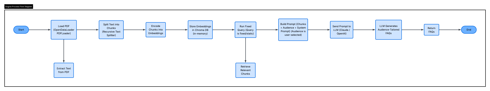

# FAQtory-app

## About
FAQ Engine is a Retrieval-Augmented Generation (RAG) based application that allows users to upload a PDF document and automatically generate FAQs tailored to a specific target audience.
 
Users interact via a UI where they upload a PDF and select their intended audience (e.g. Technical, Executive, Non-Technical). The application then processes the document through a secure ingestion pipeline and leverages a LangChain-powered RAG pipeline backed by an LLM (Claude / OpenAI) to generate relevant, audience-specific FAQs.

---
 
## Background
 
The FAQ Engine is part of a larger document processing pipeline. The broader system handles:
 
- **File Upload & Security** — User uploads PDF via UI, stored in an S3 Upload Bucket
- **Malware Scanning** — File is scanned before being moved to a secure S3 bucket
- **Invocation** — An S3 PUT event triggers a Lambda function which invokes the FAQ Engine on ECS
 
This repository contains **only the FAQ Engine**. The surrounding infrastructure (S3, Lambda, ECS, UI) is managed separately.
 
---

## How it works

### FAQ Engine Flow

The FAQ Engine runs as a sequential LangChain pipeline:
 
1. PDF is loaded using `OpenDataLoader PDFLoader`
2. Text is extracted and split into chunks using **Recursive Text Splitter**
3. Chunks are encoded into embeddings and stored in **Chroma DB** (in-memory vector store)
4. A fixed query is run against Chroma DB to retrieve chunks relevant to the selected audience
5. Retrieved chunks are combined with a **System Prompt** and the selected **Audience** to build the final prompt
6. Prompt is sent to the **LLM** (Claude / OpenAI)
7. LLM returns generated FAQs tailored to the selected audience

## Tech Stack
 
| Component | Technology |
|---|---|
| Backend / Pipeline | Python, LangChain |
| LLM | Claude / OpenAI (configurable) |
| Vector Store | Chroma DB (in-memory, switchable to FAISS) |
| Embeddings | OpenAI Embeddings |
| PDF Loader | OpenDataLoader PDFLoader |

## Upcoming / Planned Changes
 
- [ ] Apply **Text Sanitization** on extracted text + add a **Redaction Layer** to strip PII / PHI before ingestion (GDPR compliance)
- [ ] Run **PDF Loader in an isolated sandbox** (separate from the FAQ Engine) to prevent malicious document content from affecting the main pipeline
- [ ] Use peristenct Vector Store
- [ ] Add **Observability & Monitoring**

## Getting Started